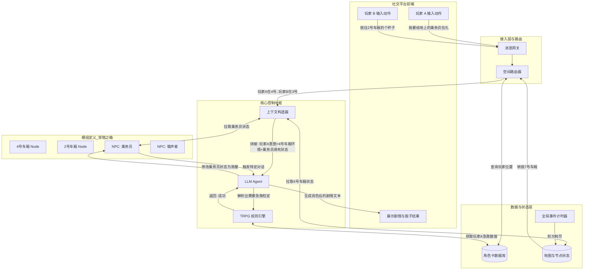

FateGear系统架构设计

针对《常暗之箱》这类具有探索、解密、战斗与时间限制的模组，系统的核心在于**“状态机驱动”与“LLM动态润色”**的分离。LLM（Agent）不决定规则判定，只负责理解玩家意图、调用规则引擎以及生成富有沉浸感的描述。

核心模块设计说明

1. 角色卡管理中心 (Card Manager)

机制：解析XML创建结构化数据（如 JSON），持久化存储。

状态维护：维护 HP、SAN、当前所在位置（Location ID）、持有物品（如：3号车厢的钥匙、手电筒）、负面状态（如：疯狂、流血）。

2. 模组与节点图谱 (Module & Node Graph)

将《常暗之箱》抽象为有向图结构。每一个车厢是一个 Node。

Node 属性：ID（如 Car_4）、描述、包含的物品、连通性（通向 Car_3 和 Car_5）。

生命周期钩子：

onEnter(player): 触发初见描述。如果是7号车厢，触发SAN check（血腥味）。

onLeave(player): 检查门是否能打开，或触发NPC跟随判定。

onSearch(player, keyword): 触发特定线索获取（如5号车厢的报纸）。

3. 地图与时空管理 (Map & Spatiotemporal Manager) —— 解决分队问题

空间隔离（Room机制）：每个 Node 相当于一个聊天频道。系统根据玩家卡片上的 Location ID，将玩家的输入路由到特定的 Node 上下文。

场景：玩家A在4号车厢救乘务员，玩家B在5号车厢看报纸。Agent 在处理A的行动时，上下文只加载4号车厢的节点信息。

全局时钟与环境事件：独立于玩家行动的全局脚本。

场景：《常暗之箱》中大嘴从后方吞噬车厢。全局时钟记录“行动轮次”或“现实时间”，达到阈值时触发 DestroyNode(Car_6)。此时如果玩家的 Location ID == Car_6，直接判定死亡。

4. 实体与行为逻辑 (NPC Logic)

NPC 作为特殊卡片：拥有和玩家一样的属性卡（如乘务员：重伤状态，带有钥匙情报）。

行为树（Behavior Tree）：在节点中预定义触发器。

乘务员逻辑：未急救前=昏迷；急救成功=提供情报；到达驾驶室=强制拉下减速杆（除非玩家对抗成功）。

循声者（Clicker）逻辑：监听所在车厢及相邻车厢的 NoiseEvent，向声源移动或发起攻击。

5. 核心Agent与规则引擎 (Core Agent & Rule Engine)

职责分离：Agent 只做阅读理解和文本生成；Rule Engine 处理数值计算。

工作流：Agent 读取玩家动作 -> 识别需要调用的技能 -> 请求 Rule Engine 掷骰子 -> 根据节点设定和骰子结果 -> 生成剧情文字。

整体架构与信息流向图

以下是系统的架构与数据交互关系图示：

具体交互信息流示例（以2号车厢潜行为例）

假设玩家已经到达3号车厢，准备进入含有 Clicker（循声者）的2号车厢。

输入阶段：玩家输入：“我要关掉手电筒，贴着墙壁蹑手蹑脚地走过去。”

状态装载：系统识别玩家位于3号车厢，目标是2号车厢。PromptBuilder 提取玩家卡片（潜行技能值）、2号车厢节点规则（无光源潜行-15%，Clicker对声音敏感）、以及此时 Clicker 的状态。

意图解析 (Agent)：Agent 判定该行为符合“潜行”规则，调用内部函数 Request_Roll("潜行", modifier=-15)。

数值判定 (Rule Engine)：骰子系统运行，比对玩家面板，得出结果（例如：大失败）。

节点判定 (Node Logic)：2号车厢的节点逻辑被触发：if(潜行==失败) -> TriggerEvent(Clicker_Alert)。

叙事生成 (Agent)：Agent 接收到【大失败】和【怪物被惊动】的结果。利用世界观设定生成文本：“车厢内一片漆黑，你贴着墙壁移动时，脚下却不慎踩到了地上的一具尸体，发出了沉闷的‘噗’声。黑暗中，那令人毛骨悚然的喘息声瞬间停滞，紧接着，伴随着刺耳的嘶吼，某个东西向你扑了过来！请进行 SAN 值检定。”

数据持久化：进入战斗状态，更新玩家和怪物的位置坐标。
