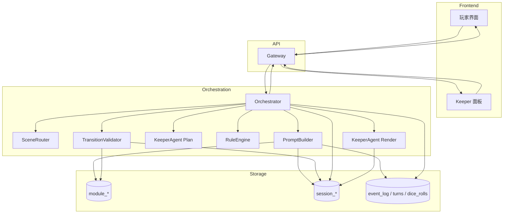
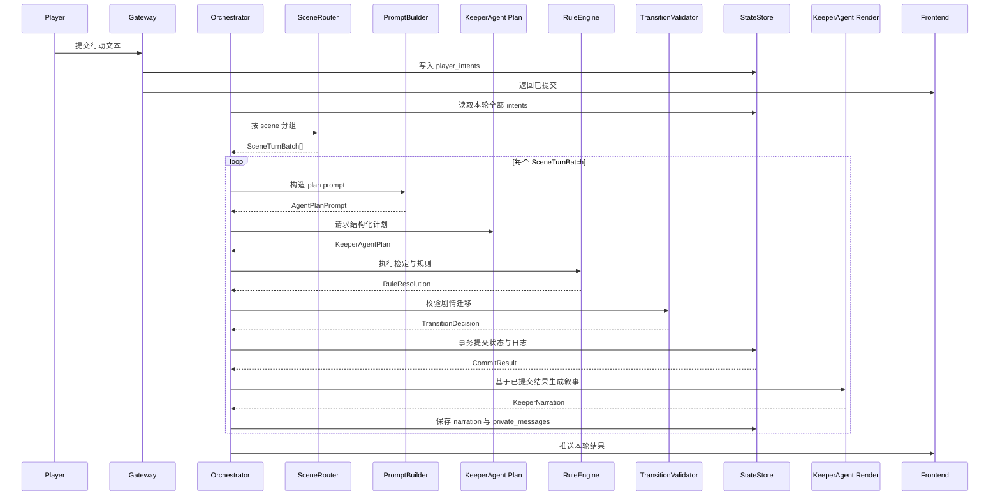

# FateGear 系统设计文档

FateGear 的目标不是做一个“会讲故事的聊天机器人”，而是做一个可落地的 COC 守密人工具。它面向固定模组、多玩家协作、私有信息隔离、剧情节奏控制和可审计的回合处理流程。

这意味着系统必须同时满足两件事：

- 有足够强的叙事能力，让玩家感受到守密人的临场反馈。
- 有足够硬的工程边界，让剧情推进、规则判定、状态迁移和日志追踪都可验证、可回放、可调试。

当前的设计结论是：

- V1 先做地图与场景事件转移。
- 地图/空间状态监控前端放在下一阶段。
- Agent 只输出提议和叙事，不直接修改数据库状态。
- 运行时核心依赖会话快照与事件日志，而不是每轮靠回放日志重建全部上下文。

## 命名空间迁移（Breaking）

自 `2026-03-30` 起，项目已完成运行时命名空间收敛：

- 旧 `scene.*` 命名空间已删除，不再提供兼容层。
- 所有运行时与领域模型统一到 `scenario.*`。
- `SceneRuntime` 的唯一入口为 `scenario.runtime.SceneRuntime`。

如果你的外部脚本仍在使用 `scene.*` 导入，请改为 `scenario.*` 对应路径。

## 1. 项目定位

FateGear 服务的不是“自由闲聊式 TRPG”，而是有明确模组边界的 COC 守密场景，例如《常暗之箱》这种强叙事、强结局约束、带有空间探索和时间压力的模组。

系统需要支持的核心能力包括：

- 多名玩家处于不同场景时的空间隔离与并行结算
- 玩家私有线索、Keeper 全局信息与公开叙事的分层输出
- 剧情阶段、场景状态、NPC 状态和规则结果的解耦
- 回合级别的审计、回放与调试

## 2. 核心设计原则

### Agent 只提议，不直接改库

任何 LLM 输出都不能直接进入数据库。Agent 负责：

- 理解玩家意图
- 提出结构化计划
- 基于已提交状态生成叙事文本

真正决定数据库状态的是：

- `RuleEngine`
- `TransitionValidator`
- `StateStore` 事务提交逻辑

### 判定与叙事分两段

一轮处理必须拆成两个阶段：

1. `KeeperAgent(Plan)` 产出结构化计划
2. `KeeperAgent(Render)` 基于已提交结果产出叙事

这样做的目的是避免“判定逻辑”和“叙事润色”互相污染。规则结果先落定，文本生成后发生。

### 会话快照优先于日志重放

系统必须保存当前会话快照，而不是要求编排器每一轮都靠事件日志回放来重建上下文。快照负责支撑：

- 高频读取
- 中频写入
- PromptBuilder 快速构造上下文
- Keeper 面板快速查询

事件日志仍然保留，但它解决的是审计和回放，不负责承担运行时主读取路径。

## 3. 三层数据模型

这套设计把三种完全不同性质的数据拆开管理。

### 模组静态定义层：`module_*`

这层解决“作者写了什么”。

- `module_info`
- `module_story_stage`
- `module_scene`
- `module_scene_transition`
- `module_npc`
- `module_clue`
- `module_trigger`

特点：

- 基本不变
- 可版本化
- 可复用
- 可做静态校验

### 会话当前快照层：`session_*`

这层解决“这一局当前是什么状态”。

- `session`
- `session_story_state`
- `session_scene_state`
- `session_player_state`
- `session_npc_state`
- `session_clue_state`
- `session_timer_state`

特点：

- 高频读
- 中频写
- 强依赖事务一致性
- 需要快速构造 prompt 和监控视图

编排器应当能够从这层一次性拉出：

- 当前剧情阶段
- 各玩家所在场景
- 在场 NPC
- 已公开与私有线索
- 危险度或倒计时
- 已触发与待触发的计时器

### 回放与审计层：`event_log` 与回合日志

这层解决“为什么会变成现在这样”。

- `turns`
- `turn_batches`
- `player_intents`
- `event_log`
- `dice_rolls`
- `narration_log`
- `private_message_log`

这层主要服务于：

- 回放某一轮发生了什么
- 检查某次剧情跳转为什么成立
- 对比玩家所见文本与全局状态差异
- 追查是 PromptBuilder、RuleEngine、Validator 还是 Agent 输出出了问题

## 4. 核心运行时组件

V1 的最小闭环围绕下面六个组件展开：

- `StoryState`
- `SceneRouter`
- `RuleEngine`
- `NPCState`
- 两段式 `KeeperAgent`
- `Turn Log + Event Log`

各组件职责如下：

### `StoryState`

负责管理剧情主阶段、分支阶段与结局锁，不负责玩家空间位置。

### `SceneRouter`

根据 `session_player_state.current_scene_id` 将玩家动作按场景分组，形成 `SceneTurnBatch`。它负责“谁和谁在同一批结算”，不负责决定剧情是否跳幕。

### `RuleEngine`

负责数值检定、对抗检定、环境修正、伤害计算、状态变化效果等规则运算。它只接受结构化输入，不解析自然语言。

### `NPCState`

负责 NPC 当前状态、位置信息、知识边界和记忆摘要。V1 不给每个 NPC 一个独立 Agent，而是由 Keeper Agent 结合 NPC 状态卡进行统一控制。

### `PromptBuilder`

从会话快照、场景批次和最近事件中构造计划阶段 prompt，不直接访问历史全量日志。

### `TransitionValidator`

校验剧情是否允许迁移，避免 Agent 越权推进剧情。它决定：

- 当前阶段能否跳到下一阶段
- 某个结局是否满足触发条件
- 某个场景事件是否允许落地

### `StateStore`

负责事务提交状态与日志，包括：

- 写入本轮结构化结果
- 更新快照表
- 写入事件日志
- 保存公开叙事与私有消息

## 5. 系统总览图



这张图对应的关键边界是：

- `KeeperAgent Plan` 不直接写数据库
- `KeeperAgent Render` 只基于已提交结果生成文本
- `SessionDB` 服务运行时快照
- `EventDB` 服务回放与审计

## 6. 一轮行动处理流程

### 回合时序图



### Python 风格核心伪代码

```python
async def resolve_turn(session_id: str, turn_no: int) -> list["KeeperNarration"]:
    snapshot = await repo.load_session_snapshot(session_id)
    intents = await repo.load_turn_intents(session_id=session_id, turn_no=turn_no)

    batches = scene_router.group_by_scene(
        intents=intents,
        players=snapshot.players,
    )

    outputs: list[KeeperNarration] = []

    for batch in batches:
        plan_prompt = prompt_builder.build_plan_prompt(
            PlanPromptInput(
                session=snapshot,
                batch=batch,
                recent_events=snapshot.recent_events,
            )
        )

        plan = await keeper_agent.plan_turn(plan_prompt)

        rule_result = rule_engine.resolve_checks(
            RuleResolutionInput(
                session=snapshot,
                plan=plan,
            )
        )

        transition_decision = transition_validator.validate_transition(
            TransitionValidationInput(
                current_stage_id=snapshot.story.current_stage_id,
                proposed_transition=plan.proposed_transition,
                story_state=snapshot.story,
                scene_state=snapshot.scenes,
                npc_state=snapshot.npcs,
                rule_effects=rule_result.effects,
            )
        )

        commit_result = await state_store.commit_turn(
            CommitTurnInput(
                session_id=session_id,
                turn_no=turn_no,
                batch=batch,
                plan=plan,
                rule_result=rule_result,
                transition_decision=transition_decision,
            )
        )

        narration = await keeper_agent.render_narration(
            RenderNarrationInput(
                committed_state=commit_result,
                visible_scope="public",
            )
        )

        await state_store.save_narration(
            session_id=session_id,
            turn_no=turn_no,
            scene_id=batch.scene_id,
            narration=narration,
        )
        outputs.append(narration)

    await state_store.finish_turn(session_id=session_id, turn_no=turn_no)
    return outputs
```

这段流程背后的核心原则是：

> 任何 LLM 输出，在进入数据库前都必须先经过规则引擎与迁移校验。

## 7. 外部产品接口

外部接口服务于玩家界面和 Keeper 工具界面。协议层继续使用 HTTP 与 JSON，但字段命名统一使用 `snake_case`。

### 创建会话

```http
POST /api/sessions
```

请求：

```json
{
  "module_id": "train_of_darkness",
  "players": [
    { "player_id": "p1", "name": "玩家A" },
    { "player_id": "p2", "name": "玩家B" }
  ]
}
```

返回：

```json
{
  "session_id": "uuid",
  "current_stage": "prologue",
  "current_turn": 1
}
```

### 提交玩家动作

```http
POST /api/sessions/{session_id}/intents
```

请求：

```json
{
  "turn_no": 1,
  "player_id": "p1",
  "raw_input": "我检查乘务员的伤口",
  "client_scene_id": "car_4"
}
```

这里的 `client_scene_id` 只作为客户端参考，服务端仍以 `session_player_state.current_scene_id` 为准。

### 结算当前轮

```http
POST /api/sessions/{session_id}/turns/{turn_no}/resolve
```

返回：

```json
{
  "turn_no": 1,
  "resolved": true,
  "batches": [
    {
      "scene_id": "car_4",
      "public_narration": "...",
      "npc_dialogues": []
    }
  ],
  "private_messages": [
    {
      "player_id": "p1",
      "content": "你注意到伤口边缘不像刀伤。"
    }
  ],
  "state_changed": true,
  "new_stage": "investigation"
}
```

### 获取玩家视角当前画面

```http
GET /api/sessions/{session_id}/view?player_id=p1
```

返回的是该玩家当前可见的信息，而不是全局状态：

```json
{
  "turn_no": 2,
  "scene": {
    "scene_id": "car_4",
    "name": "4号车厢",
    "description": "灯光忽明忽暗……"
  },
  "visible_npcs": [],
  "visible_players": [],
  "recent_narration": [],
  "private_clues": []
}
```

### 获取 Keeper 全局面板

```http
GET /api/sessions/{session_id}/keeper-view
```

这个视图需要能看到：

- 当前主剧情阶段
- 全图玩家位置
- NPC 状态
- 可触发迁移
- 计时器
- Agent 私有备注

### 公开字段口径

为避免前后端和编排层在命名上漂移，外部接口至少稳定下面这些字段：

- 会话最小字段：`session_id`、`module_id`、`current_stage`、`current_turn`
- 玩家动作最小字段：`turn_no`、`player_id`、`raw_input`、`client_scene_id`
- 回合结算最小字段：`turn_no`、`resolved`、`batches`、`private_messages`、`state_changed`、`new_stage`
- 玩家视角接口只返回该玩家当前可见信息，不暴露全局隐藏状态
- Keeper 视角接口返回全局剧情、玩家位置、NPC 状态、计时器、可触发迁移和 Agent 备注

## 8. 内部编排接口

内部接口不追求“花哨协议”，目标是稳定职责边界。下面的接口表达采用 Python 类型标注和 `pydantic.BaseModel` 风格。

### 关键输入输出模型

```python
from pydantic import BaseModel


class PlanPromptInput(BaseModel):
    session: "SessionSnapshot"
    batch: "SceneTurnBatch"
    recent_events: list["TurnEvent"]


class RuleResolutionInput(BaseModel):
    session: "SessionSnapshot"
    plan: "KeeperAgentPlan"


class TransitionValidationInput(BaseModel):
    current_stage_id: str
    proposed_transition: "ProposedTransition | None"
    story_state: "StoryState"
    scene_state: list["SceneState"]
    npc_state: list["NPCState"]
    rule_effects: list["RuleEffect"]


class CommitTurnInput(BaseModel):
    session_id: str
    turn_no: int
    batch: "SceneTurnBatch"
    plan: "KeeperAgentPlan"
    rule_result: "RuleResolution"
    transition_decision: "TransitionDecision"


class RenderNarrationInput(BaseModel):
    committed_state: "CommitResult"
    visible_scope: str
```

### 核心函数签名

```python
def build_plan_prompt(input: PlanPromptInput) -> "AgentPlanPrompt": ...


async def plan_turn(prompt: "AgentPlanPrompt") -> "KeeperAgentPlan": ...


def resolve_checks(input: RuleResolutionInput) -> "RuleResolution": ...


def validate_transition(
    input: TransitionValidationInput,
) -> "TransitionDecision": ...


async def commit_turn(input: CommitTurnInput) -> "CommitResult": ...


async def render_narration(
    input: RenderNarrationInput,
) -> "KeeperNarration": ...
```

这些接口的职责划分是：

- `PromptBuilder` 负责上下文构造
- `KeeperAgent Plan` 只做结构化计划
- `RuleEngine` 只做规则解算
- `TransitionValidator` 只做迁移校验
- `StateStore` 负责事务提交
- `KeeperAgent Render` 只在提交后生成叙事

## 9. V1 落地路线

当前最适合的主线不是先做前端，而是先打通后端最小闭环。

### 当前 V1 主线

1. 地图建模
2. 场景事件转移
3. `StoryState`
4. `TransitionValidator`
5. `Turn Log + Event Log`

这条路线优先保证：

- 地图与剧情状态分离
- 迁移条件有硬边界
- 每轮状态变化可审计
- 多场景并行结算有基础支点

### 下一阶段

- 地图/空间状态监控前端
- Keeper 全局视图
- 私有线索展示
- 多场景并行结算可视化

这部分应该建立在后端快照、日志和迁移机制已经稳定的前提上，否则前端只会成为“包装不稳定状态”的壳。

## 10. 当前实现状态

当前仓库还没有进入会话编排和地图状态阶段，已落地的内容主要是角色卡与基础数值域模型。

### 已实现

- `cards.domain.attributes`
  调查员属性对象与基础校验
- `cards.domain.state`
  当前数值状态
- `cards.domain.card`
  调查员卡片聚合根
- `cards.rules.derived`
  `HP`、`MP`、`SAN`、`MOV`、`Build`、`Damage Bonus` 等衍生公式
- `cards.rules.validation`
  `cards` 域跨模型业务校验（当前覆盖技能模板与技能定义集合校验）
- `cards.domain.skills`
  技能模板、分支技能与已具体化技能定义
- `cards.domain.build`
  从最小映射输入构建调查员卡
- `cards.seed.*`
  技能、职业、武器等 seed 骨架
- `docs/cards/model-notes.md`
  当前数值域的设计说明

### 尚未实现

- `module_* / session_* / event_log` 持久化模型
- `Orchestrator`
- `SceneRouter`
- `TransitionValidator`
- `resolve_turn` 主流程
- 地图与场景状态管理
- Keeper 监控前端

这意味着 README 里的主体内容描述的是目标架构，不是当前代码已经全部完成的现状。

当前的职责边界补充如下：

- `cards.rules.validation` 只承接 `cards` 域跨模型业务校验
- `scenario.*` 负责地图移动相关骨架与后续实现
- 剧情 `TransitionValidator` 仍未实现，且不属于 `cards`

## 11. 为什么先做地图与场景事件转移

这是当前最重要的工程判断。

如果一开始只做“AI 守密人能说话”，系统会很快看起来能跑，但在下面这些问题上迅速失控：

- 多人分场景时上下文怎么隔离
- 玩家位置变化如何驱动可见信息变化
- 某个剧情跳转为什么成立
- NPC 为什么在这一轮突然改口
- 某轮玩家看到的文本为什么和状态不一致

而先把地图、场景事件转移、剧情阶段和回合日志做对，后面无论是 Keeper 面板还是玩家视图，都有稳定的数据基础。

## 12. 当前结论

FateGear 当前最合适的架构方向不是“纯聊天 Agent”，也不是“只做游戏服务器”，而是二者融合后的守密人工具：

- 地图状态负责“人在哪里”
- 剧情状态负责“故事到哪一幕”
- 规则引擎负责“这次行动是否成立”
- Agent 负责“怎么说”和“给出什么提议”
- 日志系统负责“为什么会这样”

只要 `StoryState`、`SceneRouter`、`RuleEngine`、`NPCState`、两段式 `KeeperAgent` 和日志系统打通，FateGear 就不再是一个 AI 聊天外壳，而是一个真正可扩展的 COC 守密人工具。

## 13. FateGear V1 TODO List（按当前仓库进度勾选）

> 目标：先完成**地图与场景转移**，再按“状态机 + RuleEngine + NPCState + 两段式 Agent + Turn/Event Log”的路径推进。
>
> 勾选标准：只有已经在 README 中明确锁定的原则项，或仓库里已有代码与测试支撑的实现项才标记为完成。当前仓库仍以 `src/cards` 为主结构，尚未进入 `FastAPI + SQLAlchemy + PostgreSQL` 阶段。

### 0. 范围与原则

- [x] 明确 V1 范围：只做地图、场景转移、剧情状态机、回合流、基础规则引擎、NPC 状态、日志、基础 Agent
- [ ] 明确 V1 不做：自定义模组编辑器、每个 NPC 独立 Agent、语音、复杂长期记忆、自动配图
- [x] 明确一条核心原则：**场景转移** 和 **剧情状态转移** 必须分开建模
- [x] 明确一条核心原则：Agent 只输出“提议”，不直接写数据库
- [x] 明确一条核心原则：规则判定和叙事生成拆成两步
- [x] 明确一条核心原则：每轮必须落 `turn_log` 和 `event_log`
- [x] 先做“无 LLM 也能跑通”的最小闭环，再接入模型

### 1. Python 工程初始化

- [x] 初始化 Python 项目（建议 `uv` 或 `poetry`）
- [x] 建立基础目录结构
- [ ] 接入 `FastAPI`
- [ ] 接入 `SQLAlchemy 2.0`
- [ ] 接入 `Alembic`
- [x] 接入 `Pydantic v2`
- [x] 接入 `pytest`
- [ ] 配置 `.env` / 配置管理
- [ ] 配置日志系统
- [ ] 配置本地开发数据库（PostgreSQL）
- [ ] 建立基础异常处理和统一返回结构

#### 建议目录

- [ ] 创建 `app/api`
- [ ] 创建 `app/domain`
- [ ] 创建 `app/services`
- [ ] 创建 `app/repositories`
- [ ] 创建 `app/models`
- [ ] 创建 `app/schemas`
- [ ] 创建 `app/core`
- [x] 创建 `tests`

### 2. 地图与场景转移（第一优先级）

#### 2.1 地图数据模型

- [x] 定义 `Scene`
- [x] 为 `Scene` 增加字段：`id`
- [x] 为 `Scene` 增加字段：`module_id`
- [x] 为 `Scene` 增加字段：`name`
- [x] 为 `Scene` 增加字段：`description`
- [x] 为 `Scene` 增加字段：`tags`
- [x] 为 `Scene` 增加字段：`is_entry`
- [x] 为 `Scene` 增加字段：`is_safe_zone`
- [x] 定义 `SceneLink`
- [x] 为 `SceneLink` 增加字段：`from_scene_id`
- [x] 为 `SceneLink` 增加字段：`to_scene_id`
- [x] 为 `SceneLink` 增加字段：`is_locked`
- [x] 为 `SceneLink` 增加字段：`required_flags`
- [x] 为 `SceneLink` 增加字段：`block_reason`
- [x] 定义 `SessionMapState`
- [x] 定义 `SessionPlayerState`
- [x] 在 `SessionPlayerState` 中增加 `current_scene_id`
- [x] 在 `SessionPlayerState` 中增加 `last_scene_id`
- [x] 在 `SessionPlayerState` 中增加 `visibility_state`
- [x] 定义 `SceneInstanceState`
- [ ] 为 `SceneInstanceState` 增加字段：`visited`
- [ ] 为 `SceneInstanceState` 增加字段：`danger_level`
- [x] 为 `SceneInstanceState` 增加字段：`local_flags`
- [ ] 为 `SceneInstanceState` 增加字段：`destroyed / disabled`
- [x] 定义地图配置导入格式（JSON/YAML 都可）

#### 2.2 场景转移规则

- [x] 实现“是否可移动”校验
- [x] 支持普通相邻场景移动
- [x] 支持单向场景移动
- [x] 支持锁定场景移动
- [x] 支持条件解锁场景移动
- [ ] 支持隐藏通路
- [ ] 支持场景禁入
- [ ] 支持场景摧毁/关闭后不可进入
- [x] 支持队伍拆分到不同场景
- [x] 支持多人同场景
- [x] 支持移动后写入事件日志
- [ ] 支持移动后更新玩家可见视图

#### 2.3 `SceneRouter` 服务

- [ ] 实现 `SceneRouter.can_move(session_id, player_id, target_scene_id)`
- [ ] 实现 `SceneRouter.move_player(session_id, player_id, target_scene_id)`
- [ ] 实现 `SceneRouter.move_group(session_id, player_ids, target_scene_id)`
- [ ] 实现 `SceneRouter.list_reachable_scenes(session_id, player_id)`
- [ ] 实现 `SceneRouter.group_players_by_scene(session_id)`
- [ ] 实现 `SceneRouter.get_scene_snapshot(session_id, scene_id)`
- [ ] 实现 `SceneRouter.get_player_view(session_id, player_id)`

#### 2.4 地图相关 API

- [ ] `POST /sessions`
- [ ] `GET /sessions/{session_id}/map`
- [ ] `GET /sessions/{session_id}/view?player_id=...`
- [ ] `POST /sessions/{session_id}/move`
- [ ] `GET /sessions/{session_id}/reachable-scenes?player_id=...`

#### 2.5 地图模块验收标准

- [x] 两个玩家可以处于不同场景
- [x] 玩家移动后 `current_scene_id` 正确更新
- [x] 锁定路径会返回明确失败原因
- [ ] 视图接口只返回该玩家当前可见信息
- [x] 场景移动会生成 `event_log`
- [ ] 场景移动不会自动触发剧情状态迁移
- [ ] 服务端状态是唯一真相，前端位置仅作参考

### 3. 剧情状态机（第二优先级）

#### 3.1 剧情状态模型

- [x] 定义 `StoryState`
- [x] 定义 `StoryStage`
- [x] 为 `StoryStage` 增加字段：`id`
- [x] 为 `StoryStage` 增加字段：`name`
- [x] 为 `StoryStage` 增加字段：`description`
- [x] 为 `StoryStage` 增加字段：`required_flags`
- [x] 为 `StoryStage` 增加字段：`available_clues`
- [x] 为 `StoryStage` 增加字段：`npc_presence_rules`
- [x] 为 `StoryStage` 增加字段：`is_terminal`
- [x] 为 `StoryStage` 增加字段：`terminal_type`
- [x] 定义 `StoryTransition`
- [x] 为 `StoryTransition` 增加字段：`source_stage_id`
- [x] 为 `StoryTransition` 增加字段：`target_stage_id`
- [x] 为 `StoryTransition` 增加字段：`required_flags`
- [x] 为 `StoryTransition` 增加字段：`trigger_type`
- [x] 为 `StoryTransition` 增加字段：`priority`

#### 3.2 剧情状态服务

- [x] 实现 `TransitionValidator`
- [ ] 实现 `StoryStateService.can_transition(...)`
- [x] 实现 `StoryStateService.apply_transition(...)`
- [x] 确保剧情迁移只允许走模组定义路径
- [x] 确保未解锁结局不能被直接触发
- [x] 剧情迁移后写入 `event_log`

#### 3.3 剧情状态模块验收标准

- [x] 地图状态和剧情状态完全分离
- [ ] 即使玩家进入了某场景，也不等于剧情阶段自动推进
- [x] 必须满足 transition 条件才能进入下一剧情阶段
- [x] 终局只能由状态机合法进入

### 4. 回合、输入与结算主链路

#### 4.1 回合模型

- [ ] 定义 `Session`
- [ ] 定义 `Turn`
- [ ] 定义 `PlayerIntent`
- [ ] 定义 `SceneTurnBatch`
- [ ] 定义 `TurnResult`
- [ ] 定义 `NarrationRecord`

#### 4.2 回合服务

- [x] 实现“提交玩家动作”接口
- [x] 支持多玩家同一轮分别提交动作
- [ ] 支持房主/主持人手动触发结算
- [ ] 支持玩家全部提交后自动触发结算
- [x] 实现按场景分组 `SceneTurnBatch`
- [x] 实现每轮快照加载
- [ ] 实现结算幂等保护
- [ ] 实现结算事务提交
- [x] 实现回合结束标记

#### 4.3 回合接口

- [ ] `POST /sessions/{session_id}/intents`
- [ ] `POST /sessions/{session_id}/turns/{turn_no}/resolve`
- [ ] `GET /sessions/{session_id}/turns/{turn_no}`
- [ ] `GET /sessions/{session_id}/keeper-view`

#### 4.4 回合模块验收标准

- [x] 同一轮多个玩家动作可同时存在
- [x] 系统能按场景正确分组处理
- [ ] 同一轮重复 resolve 不会重复写状态
- [ ] 每轮结果可回放

### 5. `RuleEngine`（基础版）

#### 5.1 规则引擎骨架

- [ ] 先实现通用“动作 -> 是否需要判定 -> 执行判定 -> 返回结果”流程
- [ ] 定义 `CheckRequest`
- [ ] 定义 `CheckResult`
- [ ] 定义 `RuleEffect`
- [ ] 定义 `DiceRoll`

#### 5.2 基础能力

- [ ] 实现骰子工具
- [ ] 实现基础成功/失败判定
- [ ] 实现成功等级
- [ ] 实现对角色属性/技能值的读取
- [ ] 实现规则结果写回效果
- [ ] 实现规则结果日志落库

#### 5.3 `RuleEngine` 模块验收标准

- [ ] Agent 只决定“是否要判定”
- [ ] 判定数值全部由 `RuleEngine` 处理
- [ ] 检定结果可审计
- [ ] 检定结果可回放

### 6. `NPCState`（在场、知识边界、动态状态）

#### 6.1 NPC 数据模型

- [ ] 定义 `NPC`
- [ ] 为 `NPC` 增加字段：`name`
- [ ] 为 `NPC` 增加字段：`personality`
- [ ] 为 `NPC` 增加字段：`secrets`
- [ ] 为 `NPC` 增加字段：`knowledge_boundary`
- [ ] 为 `NPC` 增加字段：`current_scene_id`
- [ ] 为 `NPC` 增加字段：`current_emotion`
- [ ] 为 `NPC` 增加字段：`relationship_map`
- [ ] 为 `NPC` 增加字段：`dialogue_summary`
- [ ] 为 `NPC` 增加字段：`revealed_secret_flags`
- [ ] 为 `NPC` 增加字段：`alive / injured / unconscious / hostile`

#### 6.2 NPC 服务

- [ ] 实现 NPC 在场判定
- [ ] 实现 NPC 可见性判定
- [ ] 实现 NPC 对玩家关系更新
- [ ] 实现 NPC 情绪更新
- [ ] 实现 NPC 已透露秘密写回
- [ ] 实现 NPC 与场景联动
- [ ] 实现 NPC 与剧情阶段联动

#### 6.3 NPC 模块验收标准

- [ ] NPC 是否出现由场景和剧情共同决定
- [ ] NPC 说话内容不越过知识边界
- [ ] NPC 已透露过的信息不会“剧情倒流”
- [ ] NPC 动态状态会持续保留

### 7. `PromptBuilder + 两段式 Agent`

#### 7.1 `PromptBuilder`

- [ ] 定义永久层：规则与系统约束
- [ ] 定义模组层：世界观与模组说明
- [ ] 定义剧情阶段层：当前 `StoryStage`
- [ ] 定义空间快照层：当前 `Scene` + 在场 NPC + 玩家位置
- [ ] 定义历史摘要层：最近 N 轮关键事件
- [ ] 定义私有层：仅守密人可见提示
- [ ] 实现 Prompt 拼装器
- [ ] 实现 token 控制策略

#### 7.2 Plan 阶段 Agent

- [ ] 定义结构化输出 schema
- [ ] 让 Agent 输出：动作理解
- [ ] 让 Agent 输出：是否需要检定
- [ ] 让 Agent 输出：拟议状态变化
- [ ] 让 Agent 输出：拟议剧情迁移
- [ ] 让 Agent 输出：守密人私有备注
- [ ] 让 Agent 不直接输出最终数据库状态

#### 7.3 Render 阶段 Agent

- [ ] 根据已提交结果生成公共叙事
- [ ] 根据已提交结果生成 NPC 台词
- [ ] 根据已提交结果生成私有线索
- [ ] 根据已提交结果生成守密人提示
- [ ] 保证渲染阶段只读，不改状态

#### 7.4 Agent 模块验收标准

- [ ] 没有通过校验的 Agent 提议不会落库
- [ ] 叙事文本基于“已提交结果”生成
- [ ] 模型失效时可退化为模板化文本
- [ ] Agent 输出结构可记录和回放

### 8. 日志、审计与回放

#### 8.1 日志表

- [ ] 定义 `turn_log`
- [ ] 定义 `event_log`
- [ ] 定义 `dice_roll_log`
- [ ] 定义 `agent_plan_log`
- [ ] 定义 `narration_log`

#### 8.2 日志内容

- [ ] 记录玩家原始输入
- [ ] 记录解析后的动作意图
- [ ] 记录检定请求
- [ ] 记录骰子结果
- [ ] 记录 Agent 提议
- [ ] 记录状态提交结果
- [ ] 记录剧情迁移结果
- [ ] 记录最终叙事文本

#### 8.3 回放与调试

- [ ] 实现按回合查看日志
- [ ] 实现按玩家查看私有信息
- [ ] 实现按场景查看事件
- [ ] 实现按 NPC 查看状态变化
- [ ] 实现 Keeper 调试面板

#### 8.4 日志模块验收标准

- [ ] 可以回答“为什么剧情跳了”
- [ ] 可以回答“为什么 NPC 改口了”
- [ ] 可以回答“为什么这轮触发了检定”
- [ ] 可以回放某轮完整处理链路

### 9. Keeper 面板（基础版）

- [ ] 查看当前剧情阶段
- [ ] 查看全图玩家位置
- [ ] 查看场景占用情况
- [ ] 查看 NPC 当前状态
- [ ] 查看本轮待处理动作
- [ ] 查看最近事件日志
- [ ] 查看可触发剧情迁移
- [ ] 查看守密人私有提示

### 10. 测试清单

#### 10.1 单元测试

- [ ] `SceneRouter.can_move`
- [ ] `SceneRouter.move_player`
- [ ] `SceneRouter.group_players_by_scene`
- [x] `TransitionValidator.can_transition`
- [ ] `RuleEngine.resolve_checks`
- [ ] `NPCState` 更新逻辑

#### 10.2 集成测试

- [x] 创建会话 -> 进入初始场景
- [x] 玩家移动 -> 场景快照更新
- [x] 多玩家分场景 -> 正确分 batch
- [ ] 一轮 resolve -> 规则判定 -> 状态提交 -> 叙事输出
- [x] 剧情状态合法迁移
- [ ] 剧情状态非法迁移被拦截

#### 10.3 回归测试

- [ ] 同一模组多次运行结果稳定
- [ ] 重复提交 resolve 不会重复结算
- [ ] 断线后可恢复会话状态
- [ ] 日志完整可追踪

### 11. 开发里程碑

#### M1：地图与场景转移跑通（不接 LLM）

- [x] 完成地图模型
- [ ] 完成 `SceneRouter`
- [ ] 完成移动接口
- [ ] 完成玩家视图接口
- [x] 完成事件日志
- [x] 完成多人分场景支持

#### M2：剧情状态机接入

- [x] 完成 `StoryState`
- [x] 完成 `TransitionValidator`
- [x] 完成剧情迁移日志
- [x] 完成“场景转移 != 剧情转移”校验

#### M3：回合流 + `RuleEngine` 跑通

- [x] 完成 Intent 提交
- [x] 完成按场景分组
- [ ] 完成基础规则判定
- [ ] 完成一轮结算事务

#### M4：`NPCState` 跑通

- [ ] 完成 NPC 数据模型
- [ ] 完成在场判定
- [ ] 完成知识边界与状态更新

#### M5：两段式 Agent 接入

- [ ] 完成 Plan 阶段结构化输出
- [ ] 完成 Validator 校验
- [ ] 完成 Render 阶段叙事生成
- [ ] 完成 Agent 日志

#### M6：Keeper 调试面板

- [ ] 完成全局视图
- [ ] 完成回放能力
- [ ] 完成调试信息查看

### 12. 当前最推荐的开工顺序

- [ ] 先做数据库模型：`Scene / SceneLink / SessionPlayerState / SceneInstanceState`
- [ ] 再做 `SceneRouter`
- [ ] 再做“玩家移动 + 玩家视图 + event_log”
- [ ] 然后做 `StoryState + TransitionValidator`
- [ ] 然后做 `Turn / Intent / Resolve`
- [ ] 然后做 `RuleEngine`
- [ ] 然后做 `NPCState`
- [ ] 最后接 `PromptBuilder + 两段式 Agent`

### 13. V1 完成定义（Done Definition）

- [x] 可以创建一局游戏
- [x] 可以加载一张模组地图
- [x] 玩家可以在合法场景间移动
- [x] 多玩家可以分处不同场景
- [x] 系统可以按场景结算玩家动作
- [x] 剧情只能通过状态机合法推进
- [ ] NPC 有位置、状态、知识边界
- [ ] 检定结果由 `RuleEngine` 计算
- [ ] Agent 只提议，不直接写库
- [ ] 每轮都有完整日志可查
- [ ] Keeper 能看到全局面板
- [ ] 没有 LLM 时，系统也能以模板方式完成基本结算
