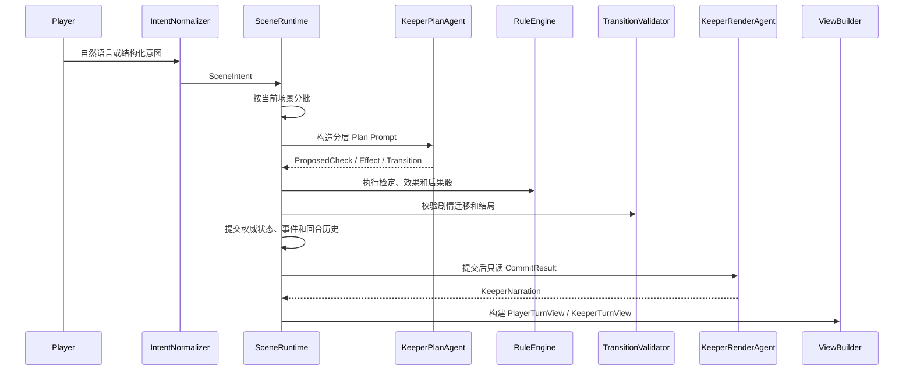

# FateGear

FateGear 是一个面向 Call of Cthulhu 7e 跑团的 LLM 守密人运行时原型。它的目标不是做一个“会讲故事的聊天机器人”，而是把模组、玩家意图、规则检定、剧情状态、私密信息、叙事生成和审计日志放进同一条可验证的回合链路里。

当前版本已经能跑通一个最小 COC/KP 后端闭环：玩家提交结构化或自然语言意图，运行时按场景分批处理，Plan Agent 只提出建议，RuleEngine 与剧情状态机提交权威结果，Render Agent 在提交后生成公共叙事、NPC 台词和私密线索，最后通过玩家/守密人视图和 JSONL 审计日志暴露结果。

## 当前定位

FateGear 服务的是有明确模组边界的跑团，而不是开放式闲聊。当前重点是：

- 固定模组下的场景探索、行动结算和剧情推进。
- 多玩家同团时的场景分组、公开/私密/keeper-only 信息隔离。
- COC 7e 调查员卡、技能检定、成功等级、SAN/HP 后果和暗骰。
- LLM 参与意图理解、检定建议和叙事生成，但不能直接改写权威状态。
- 每回合可审计、可回放、可定位问题来源。

一句话概括当前架构：

```text
玩家输入 -> IntentNormalizer / Intent Agent
        -> SceneRuntime 按场景分批
        -> KeeperPlanAgent 提议
        -> RuleEngine / TransitionValidator 裁定
        -> 提交 flags、clocks、位置、状态、剧情阶段
        -> KeeperRenderAgent 只读叙事
        -> PlayerView / KeeperView / audit log
```

## 当前进度

### 已实现

- `scenario.*` 运行时命名空间，旧 `scene.*` 已移除。
- YAML 模组加载与校验，支持 `scenes`、`links`、`actions`、`clocks`、`story_stages`、`story_transitions`、`endings`。
- COC 调查员卡、属性、技能、派生值、基础规则服务。
- 内存版 `SceneRuntime`，支持建团、加人、提交意图、结算回合、回合历史和幂等重放。
- `RuleEngine`，支持动作前置条件、D100 技能检定、成功等级、flag/clock 效果、简单 `NdM` 后果骰。
- 自然语言 `IntentNormalizer`，支持移动、动作别名、观察/自由行动、澄清候选项、边界行动识别。
- 可选 `KeeperIntentAgent`，用于处理确定性规则无法接受的模糊自然语言输入。
- 两段式 Keeper Agent：
  - `KeeperPlanAgent` 输出结构化提议。
  - `KeeperRenderAgent` 在权威提交后生成叙事。
- `PromptBuilder` 分层上下文：system、module、spatial、history、keeper_private、narrative。
- 只读 `NarrativeContext`：NPC 人设卡、世界书、氛围、文风控制、安全边界、上下文预算和跳过原因。
- 玩家/守密人视图：
  - `PlayerTurnView` 只显示本人可见信息。
  - `KeeperTurnView` 保留全局事件、keeper-only 内容和暗骰。
  - 玩家视图与守密人视图支持 `requester_id` 访问边界。
- 骰子审计：
  - 静态动作检定。
  - 动态 Agent 检定。
  - 运行时自由行动兜底检定。
  - SAN/HP 状态后果骰。
- 危险边界自由行动规则：
  - 玩家主动申请技能时才进行公开技能检定。
  - 玩家未申请技能却试探地图外/高危边界时，KP 暗骰给出随危险升级的后果。
  - 暗骰不进入玩家视图，但仍会修改权威 SAN/HP 状态。
- `JsonScenarioStateStore`，支持会话快照和回合历史 JSON 持久化与恢复。
- KP 视角 JSONL 审计日志，可记录建团、加入、意图提交、结算、视图结果和内部回合结果。
- `scenario.narration` 叙事管线实验层，包含叙事输入、记忆、prompt、验证、补丁、记录和回放能力。
- HTTP API，基于 `aiohttp` 暴露建团、加人、提交意图、自然语言意图、结算、玩家视图和守密人视图。
- CLI 玩法入口，支持离线规则模式下查看状态、骰子和结果。
- 两个样例模组：
  - `generic_mvp`：通用设施逃离 MVP。
  - `tokoyami_subset`：《常暗之厢》最小验证模组，包含 NPC、世界书、氛围、后方威胁时钟、真/坏结局。

### 正在成形但还不是产品级

- NPC 目前主要是模组叙事上下文，还没有完整 `SessionNPCState`、离屏行动、关系记忆和权威知识边界状态。
- 线索还没有形成完整 `ClueGraph`、线索迁移、误解修正和 fail-forward 投递机制。
- COC 规则仍是基础子集，尚未覆盖奖励/惩罚骰、Luck、对抗检定、战斗、追逐、疯狂症状等完整规则。
- 视图访问边界是服务层校验，还不是正式身份认证/令牌系统。
- `SceneRuntime.resolve_turn()` 仍偏重，后续应继续拆出 PaceDirector、ClueManager、NPCController、VisibilityService。
- 当前持久化以 JSON store 为主，数据库级事务、跨进程锁和线上观测还未完成。
- 还没有正式前端和 Keeper 面板。

## 目录结构

```text
FateGear/
  main.py                         # aiohttp 服务入口
  module/                         # YAML 模组
    generic_mvp/
    tokoyami_subset/
  src/
    cards/                        # COC 调查员卡、技能、规则和 IO
    scenario/
      agent/                      # Intent / Plan / Render Agent 契约与调用
      api.py                      # ScenarioService 服务层
      audit/                      # KP JSONL 审计日志
      context/                    # NarrativeContext 选择器
      intent/                     # 自然语言意图归一化
      io/                         # 模组加载
      module/                     # 模组 schema 与校验
      narration/                  # 实验性叙事管线
      runtime/                    # SceneRuntime、RuleEngine、回合契约
      session/                    # 会话快照
      story/                      # 剧情阶段与迁移
      store/                      # JSON StateStore
      view/                       # 玩家/守密人视图投影
  tests/
    cards/
    scene/
  docs/
    fategear-kp-framework-research.md
    fategear-five-iteration-upgrade.md
```

## 运行方式

### 1. 安装依赖

```powershell
python -m venv .venv
.\.venv\Scripts\Activate.ps1
pip install -r requirements.txt
```

### 2. 启动离线规则模式

离线模式不需要 LLM API key，适合验证模组、规则和 API。

```powershell
python main.py --no-agents
```

默认服务地址：

```text
http://127.0.0.1:8000
```

### 3. 启动带 Agent 的模式

复制 `.env.example`，配置任一 provider。

```powershell
Copy-Item .env.example .env
```

常用环境变量：

```text
AGENT_API_KEY=
AGENT_BASE_URL=
PLANNER_AGENT_MODEL=
NARRATOR_AGENT_MODEL=

DEEPSEEK_API_KEY=
DEEPSEEK_BASE_URL=https://api.deepseek.com
DEEPSEEK_THINKING=disabled
```

启动：

```powershell
python main.py
```

可选参数：

```powershell
python main.py --host 127.0.0.1 --port 8000 --module-root .\module
python main.py --no-agents --no-kp-log
python main.py --kp-log-path .\log\kp-flow.jsonl
```

## HTTP API 速览

### 健康检查和模组列表

```powershell
Invoke-RestMethod http://127.0.0.1:8000/health
Invoke-RestMethod http://127.0.0.1:8000/modules
```

### 创建会话

```powershell
$party = Invoke-RestMethod `
  -Method Post `
  -Uri http://127.0.0.1:8000/sessions `
  -ContentType application/json `
  -Body '{"module_id":"tokoyami_subset","creator_id":"keeper"}'

$party
```

### 加入玩家

```powershell
Invoke-RestMethod `
  -Method Post `
  -Uri "http://127.0.0.1:8000/sessions/$($party.session_id)/players" `
  -ContentType application/json `
  -Body '{"player_id":"player_1"}'
```

### 提交结构化意图

```powershell
Invoke-RestMethod `
  -Method Post `
  -Uri "http://127.0.0.1:8000/sessions/$($party.session_id)/intents" `
  -ContentType application/json `
  -Body '{"player_id":"keeper","intent":{"type":"action","action_id":"inspect_note"}}'
```

### 提交自然语言意图

```powershell
Invoke-RestMethod `
  -Method Post `
  -Uri "http://127.0.0.1:8000/sessions/$($party.session_id)/text-intents" `
  -ContentType application/json `
  -Body '{"player_id":"keeper","text":"我查看门上的便签"}'
```

### 结算回合

`resolve` 返回守密人回合视图，不直接裸返内部 `TurnResolution`。

```powershell
Invoke-RestMethod `
  -Method Post `
  -Uri "http://127.0.0.1:8000/sessions/$($party.session_id)/resolve" `
  -ContentType application/json `
  -Body '{"requester_id":"keeper"}'
```

幂等重放：

```powershell
Invoke-RestMethod `
  -Method Post `
  -Uri "http://127.0.0.1:8000/sessions/$($party.session_id)/resolve" `
  -ContentType application/json `
  -Body '{"expected_turn":1,"requester_id":"keeper"}'
```

### 查看玩家视图和守密人视图

```powershell
Invoke-RestMethod `
  "http://127.0.0.1:8000/sessions/$($party.session_id)/players/keeper/view?requester_id=keeper"

Invoke-RestMethod `
  "http://127.0.0.1:8000/sessions/$($party.session_id)/keeper-view?requester_id=keeper"
```

## 回合处理模型



核心原则：

- Plan 阶段只能提出结构化建议。
- RuleEngine 和 TransitionValidator 才能决定规则与剧情是否生效。
- Render 阶段只能读取已提交事实并生成叙事。
- 私密线索、keeper-only 台词和暗骰必须通过视图层过滤。
- 审计日志保留“为什么变成现在这样”，不是每轮 prompt 的主读取路径。

## 模组写法

模组使用 YAML。当前 schema 的主干如下：

```yaml
module_id: tokoyami_subset
title: 常暗之厢最小验证模组
entry_scene_id: car_6
entry_stage_id: awake

narrative_context:
  worldview_brief: ...
  npcs: []
  lorebook_entries: []
  safety_boundaries: []
  atmosphere: {}
  prose_controls: {}

flags: []
scenes: []
links: []
actions: []
clocks: []
story_stages: []
story_transitions: []
endings: []
```

动作可以提供自然语言匹配和叙事所需的作者信息：

```yaml
actions:
  - id: find_key
    scene_id: car_3
    name: 寻找钥匙
    kind: search
    description: 在3号车厢杂乱行李间寻找驾驶室钥匙。
    aliases: [找钥匙, 搜钥匙, 翻行李]
    expected_inputs: [钥匙, 行李, 箱子]
    stakes: 成功会找到驾驶室钥匙；失败会浪费本回合机会。
    fail_forward_hint: 失败时可以暴露钥匙曾被移动过的迹象。
    check:
      skill_key: spot_hidden
      difficulty: regular
      failure_reason: 你没有在行李间找到钥匙。
    effects_on_success:
      - type: set_flag
        flag: key_obtained
```

当前样例模组可参考：

- `module/generic_mvp/module.yaml`
- `module/tokoyami_subset/module.yaml`

## 骰子与暗骰

FateGear 把骰子作为跑团核心反馈，而不是纯文本修饰。

- 玩家可见检定会进入 `PlayerTurnView.dice_rolls`。
- keeper-only 暗骰只进入 `KeeperTurnView.dice_rolls`。
- SAN/HP 后果骰会真实修改调查员状态。
- `DiceRollAudit.display_text` 用于保留面向跑团的展示文本，例如 `SAN CHECK`、`投掷骰子 1d3=3`。
- `critical`、`extreme`、`hard`、`regular`、`fail`、`fumble` 保持独立语义，`fumble` 不会被当作成功。

危险边界自由行动的当前规则：

- 玩家明确说“用侦查/聆听/潜行检定”时，运行时执行公开检定。
- 玩家不申请技能却继续试探地图外、黑暗、声源、车外等高危边界时，运行时走 `status_consequence`。
- 惩罚强度随 prior boundary attempts、`rear_threat` 时钟和动作危险性升级。
- 暗骰可以隐藏展示，但不能隐藏状态后果。

## 视图与信息隔离

当前有两类主要视图：

- `PlayerTurnView` / `PlayerSessionView`
- `KeeperTurnView` / `KeeperSessionView`

玩家视图会过滤：

- 其他玩家的私有线索。
- keeper-only NPC 台词。
- `keeper_hint`。
- `visibility="keeper"` 的暗骰。

守密人视图保留：

- 全部场景批次。
- 全部事件日志。
- 全部骰点审计。
- 私有线索和 keeper-only 信息。

服务层目前使用 `requester_id` 做基础访问边界：

- 玩家视图：本人或团主可看。
- 守密人视图：团主可看。

## 审计与持久化

当前有三类记录能力：

- `TurnResolution`：本轮内部权威结果，包含 scene batches、event log、dice rolls、agent calls、flags、clocks、story transition、ending。
- `JsonScenarioStateStore`：将会话快照和已结算回合保存到 JSON，并在新运行时实例启动后恢复。
- `JsonlKPAuditLogger`：服务层 KP 视角 JSONL 审计，记录建团、加入、意图提交、回合结算和视图结果。

这三者的分工：

- 会话快照服务高频运行。
- 回合历史服务幂等重放和视图构建。
- JSONL 审计服务排错、复盘和离线分析。

## 开发与验证

常用测试：

```powershell
pytest
```

针对场景运行时：

```powershell
pytest tests/scene
```

针对卡牌/调查员规则：

```powershell
pytest tests/cards
```

静态检查：

```powershell
ruff check src tests
git diff --check
```

当前历史上最有价值的回归测试包括：

- `tests/scene/test_runtime_action_checks.py`
- `tests/scene/test_runtime_views.py`
- `tests/scene/test_intent_normalizer.py`
- `tests/scene/test_context_selector.py`
- `tests/scene/test_state_store.py`
- `tests/scene/test_kp_audit_log.py`
- `tests/scene/test_narration_*`

## 近期路线

### P0：让一小段模组真的自然可玩

- 强化自然语言意图：长句、多目标、追问、撤回和补充说明。
- 把骰子前 stakes、失败后果和 fail-forward 写入稳定流程。
- 让 CLI/HTTP 示例形成可连续体验的一轮小跑团。

### P1：补调查核心数据层

- `ModuleClue` / `SessionClueState`。
- `ClueGraph`：发现、遗漏、误解、迁移和冗余线索。
- 私有线索投递、已知边界和玩家视角查询。

### P2：补 NPC 状态层

- `SessionNPCState`：位置、状态、情绪、态度、知识、秘密、下一步行动。
- NPC 离屏行动和世界时钟。
- NPC 不能全知、不能瞬移、不能泄漏未授权秘密。

### P3：补节奏导演

- `PaceDirector`：卡关检测、危险升级、场景停滞、提示投递、聚光灯管理。
- 将 `rear_threat` 这种模组时钟抽象成通用压力机制。

### P4：补产品化外壳

- 正式身份认证和访问日志。
- 数据库级 StateStore。
- Keeper 面板。
- 玩家前端。
- Agent prompt/output 完整落库和可观测性。

## 设计边界

FateGear 最重要的边界是：

> LLM 可以帮助理解、建议和叙述，但不能成为游戏事实的唯一来源。

因此：

- 模组静态事实来自 YAML。
- 会话事实来自 `SessionMapState`。
- 规则事实来自 `RuleEngine`。
- 剧情迁移来自 `TransitionValidator`。
- 叙事文本来自 Render Agent，但只能描述已提交结果。
- 事件日志和回合历史负责回答“为什么会这样”。

这个边界会让系统比纯 prompt 跑团慢一些、硬一些，但它换来的是可审计、可回放、可测试，也更适合以后扩展成多人在线跑团工具。
